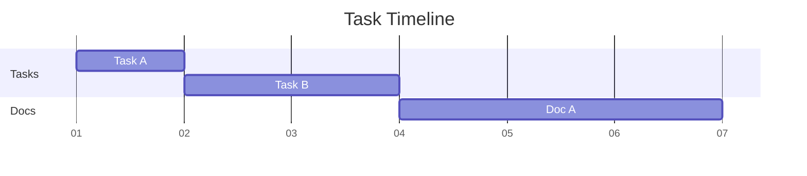

For the last years of my professional life, I've always seem to come back to the
topic of the "right" way to document architectures of software or ML systems.
More precisely, I've been looking for a diagrams as code engine that is able to
visualize Cloud architectures with appropriate service symbols.

In this post, I'd like to lay out my findings and my current approach.

## A short history of architecture diagrams

I've been using confluence to create documentation for most of my professional life.
Confluence comes with a [draw.io](https://app.diagrams.net/) widget which, naturally, 
led to me coming into contact with draw.io first.
Even though it's not a diagrams as code engine, it has quality of life features other
WYSIWYG solutions lack. One feature I've grown to like especially is that it's possible
to embed the source diagram into a PNG image export--which means that we only need to
check in one file into version control and there will be no complaints about the
one having the source file of the exported diagram being on vacation.
Additionally, it lets you download official icons for services of different cloud
hyperscalers (Azure, AWS, GCP) so that you can even use it to sketch multi-cloud
solutions.

With all these advantages and plusses, draw.io still comes with the usual disadvantage
of WYSIWYG solutions: While creating a diagram from sketch is a nice user experience,
editing and reorganizing an existing diagram is a giant pain in the butt: adding nodes
in the middle of a well-organized, thought-out layout often means re-creating the
whole diagram from sketch or moving nodes carefully from one place into another--only to realize that there still isn't enough space for the new piece of architecture.
That said, draw.io comes with a "layout" feature that may automatically reorganize your
diagram. In my tests, though, this always led to complete destruction and chaos.

## Diagrams as code solutions

Finding a diagrams as code solution as feature complete as draw.io was a hard, and maybe
even impossible, task. I've come into contact with [mermaid](https://mermaid.js.org/)
early on in my career and I still think that it has the nicest and most
intuitive syntax of all diagrams as code tools. Also, [the Python library
`diagrams`](https://diagrams.mingrammer.com/) seemed promising when starting out.

### Mermaid

Because we'll only use Mermaid as a gantt chart engine, we'll only give an
opinionated example of a gantt chart here.

I only do gantt charts for giving a rough idea of a project timeline these days,
with weeks as a time period. What I like about mermaid:
It's possible to group your components into sections.



While I haven't figured out a way to generically set the first task to
the first week, it's good enough to specify 2025-01-06 as a start date
for the first tasks and then declare dependencies for all following tasks.
This way, reorganizing the gantt chart and adding new components is as quick
as it gets.

### D2

## My current approach

Because there's no single solution that satisfies all my requirements, I've come
to the following conclusion.

- For architecture and relationship diagrams, I'll use d2.
- For gantt charts, I'll use mermaid.
