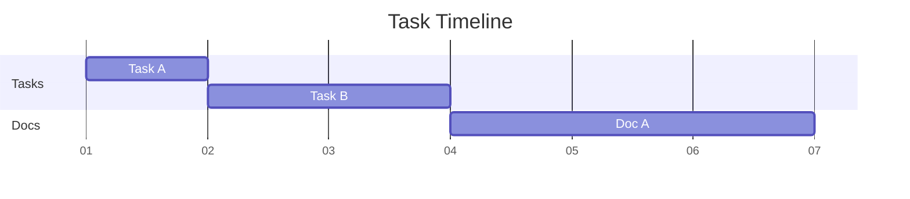

For the last years of my professional life, I've always seem to come back to the
topic of the "right" way to document architectures of software or ML systems.
More precisely, I've been looking for a diagrams as code engine that is able to
visualize Cloud architectures with appropriate service symbols.

In this post, I'd like to lay out my findings and my current approach.

## A short history of architecture diagrams

I've been using confluence to create documentation for most of my professional life.
Confluence comes with a [draw.io](https://app.diagrams.net/) widget which, naturally, 
led to me coming into contact with draw.io first.
Even though it's not a diagrams as code engine, it has quality of life features other
WYSIWYG solutions lack. One feature I've grown to like especially is that it's possible
to embed the source diagram into a PNG image export--which means that we only need to
check in one file into version control and there will be no complaints about the
person having the source file of the exported diagram being on vacation.
Additionally, it lets you download official icons for services of different cloud
hyperscalers (Azure, AWS, GCP) so that you can even use it to sketch multi-cloud
solutions.

With all these advantages and plusses, draw.io still comes with the usual
disadvantage of WYSIWYG solutions: While creating a diagram from scratch is a
nice experience, editing and reorganizing an existing diagram is a giant pain in
the butt. Adding nodes in the middle of a well-organized, thought-out layout
often means re-creating the whole diagram or moving nodes carefully from one
place into another--only to realize that there still isn't enough space for the
new piece of architecture.  That said, draw.io comes with a "layout" feature
that may automatically reorganize your diagram. In my tests, though, this always
led to complete destruction and chaos.

## Diagrams as code solutions

Finding a diagrams as code solution as feature complete as draw.io was a hard, and maybe
even impossible, task. Let's first go over the diagram engines I'm not using anymore.

[The Python library
`diagrams`](https://diagrams.mingrammer.com/) seemed promising when starting out
but I soon gave up on it: This is not a strong argument, but my guts tell me that
I'd rather have a strict, narrow declaration language than a full-blown programming
language at my disposal when creating diagrams -- if only for the reason that I sense
that in the end somebody will abuse that power and generate diagrams rather than
declaring them.

[PlantUML](https://plantuml.com) is powerful, mature and delivers all features of
all diagram types, with icons of Cloud services being supported out of the box
via import statements.
However, and this is rather a matter of taste than an argument, the rendered
diagrams didn't look as sexy as in the other engines and its syntax didn't
click with me as well as the other ones.

### Mermaid

I've come into contact with [mermaid](https://mermaid.js.org/)
early on in my career and I still think that it has the nicest and most
intuitive syntax of all diagrams as code tools. 
Unfortunately, I couldn't get mermaid to work with official GCP or AWS icons; [the
documentation about this](https://mermaid.js.org/config/icons.html) is vague
because it only states how to import icon packs in JS, while it's unclear how and
where to add that configuration when using mermaid only as a CLI.
There's an [open GitHub issue](https://github.com/mermaid-js/mermaid/issues/6109)
where others are having similar problems, suggesting to rethink the entire
architecture diagram feature from scratch.

This is why I only use Mermaid as a gantt chart engine. Here's an example.





I only do gantt charts for giving a rough project timeline these days,
with weeks as a time period. What I like about mermaid:
It's possible to group your components into sections.

While I haven't figured out a way to generically set the first task to
the first week, it's good enough to specify 2025-01-06 as a start date
for the first tasks and then declare dependencies for all following tasks.
This way, reorganizing the gantt chart and adding new components is as quick
as it gets.

Try [the mermaid playground](https://mermaid.live) if you want to play around
with mermaid yourself.

### D2

Here's a diagram written in d2lang that demonstrates how to create a simple
RAG architecture on GCP with it.

```d2lang
direction: right
user: User {
  shape: person
}
gcp_services: "Google Cloud Platform" {
  style.fill: "#ffffdd"
  frontend: "Frontend" {
    icon: "https://icons.terrastruct.com/gcp%2FProducts%20and%20services%2FCompute%2FCloud%20Run.svg"
    shape: image
  }

  backend: "Backend" {
    icon: "https://icons.terrastruct.com/gcp%2FProducts%20and%20services%2FCompute%2FCloud%20Run.svg"
    shape: image
  }

  gemini: "Gemini\n(Vertex AI)" {
    icon: "https://icons.terrastruct.com/gcp%2FProducts%20and%20services%2FAI%20and%20Machine%20Learning%2FAI%20Platform.svg"
    shape: image
  }

  datastore: "AI Application\nData Store" {
    icon: "https://icons.terrastruct.com/gcp%2FProducts%20and%20services%2FDatabases%2FCloud%20Datastore.svg"
    shape: image
  }

  frontend -> backend: "Forward requests"
  backend -> frontend: "Return responses"
  backend -> gemini: "Send requests to gemini"
  gemini -> backend: "Send responses or tool call requests"
  backend <-> datastore: "React to tool call requests"
}
user -> gcp_services.frontend: "Interacts with UI"
```



If you happen to know the [icons and styles from the official Google slide
deck](https://docs.google.com/presentation/d/1fD1AwQo4E9Un6012zyPEb7NvUAGlzF6L-vo5DbUe4NQ/edit#slide=id.ga472c7d3d1_3_834),
this looks different and needs some styling but is good enough for my purposes.

Try [the d2lang playground](https://play.d2lang.com/) if you want to play around
with d2lang yourself.

## My current approach

Because there's no single solution that satisfies all my requirements, I've come
to the following conclusion.

- For architecture and relationship diagrams, I'll use d2.
- For gantt charts, I'll use mermaid.
